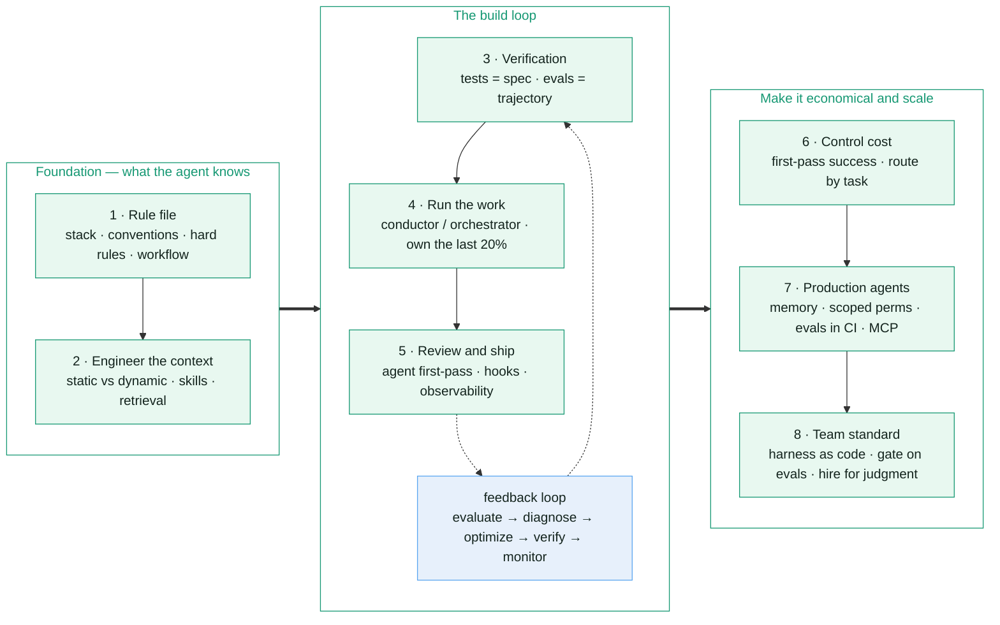

<head>
  
</head>

# The Agentic Engineering Workflow

A practical, eight-part guide to moving from ad-hoc AI prompting to a disciplined workflow you can rely on in production. Each part is self-contained: read it, copy the examples, and set up that piece of your own workflow.

The thread running through all eight: **your real output is no longer code — it's the system that produces code.** The model is one small part of that system. Everything you build around it (rules, context, tests, review, observability) is what determines whether the output is trustworthy.

## How the workflow works

## The series

1. **[Set up the rule file](/rule-file)** — give the agent the project knowledge a new teammate would need.
2. **[Engineer the context](/context-engineering)** — control what the agent sees, and when.
3. **[Build verification](/verification)** — tests and evals as the contract with the AI.
4. **[Run the work](/running-the-work)** — conductor vs orchestrator, and where agents fit in your day.
5. **[Review and ship](/review-and-ship)** — catch the failures that "look right."
6. **[Control cost](/controlling-cost)** — total cost of ownership and model routing.
7. **[Ship production agents](/production-agents)** — from a prototype script to a product with a substrate.
8. **[Make it a team standard](/team-standard)** — version the harness, gate on evals, hire for judgment.

## How to use this

- **Solo developer?** Parts 1–6 are enough to transform your daily workflow. Start with Part 1.
- **Building an AI product?** Add Part 7.
- **Leading a team?** Parts 1–8, with extra weight on 3, 5, and 8.

---

Source: [*The New SDLC With Vibe Coding*](https://www.kaggle.com/whitepaper-the-new-SDLC-with-vibe-coding) (Google)
